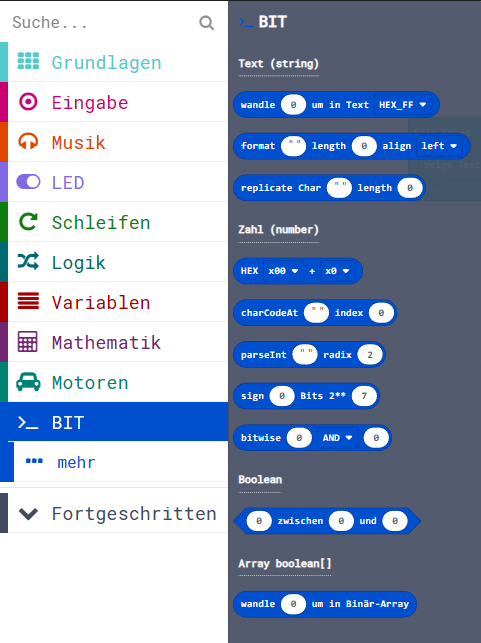

> Diese Seite bei [https://calliope-net.github.io/bit/](https://calliope-net.github.io/bit/) öffnen

## Als Erweiterung verwenden

Dieses Repository kann als **Erweiterung** in MakeCode hinzugefügt werden.

* öffne [makecode.calliope.cc](https://makecode.calliope.cc)
* klicke auf die Projektvorlage **Calliope mini 2.x**
* klicke auf **Erweiterungen** unter dem Zahnrad-Menü (Fortgeschritten - Erweiterungen)
* kopiere die folgende **Projekt-URL** in die Zwischenablage
* **https://github.com/calliope-net/bit**
  * (dreimal klicken, um die ganze Zeile zu kopieren, strg-C)
* füge sie auf der Webseite oben ein (strg-V) und klicke auf die Lupe (oder ENTER)

* zuletzt noch auf das Rechteck klicken - jetzt ist ein neuer Block dazu gekommen

#### Metadaten (verwendet für Suche, Rendering)

* Calliope mini
